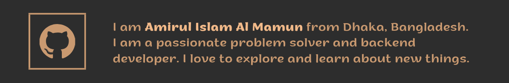

   

<!--  -->

I am Amirul Islam Al Mamun 😃 from Dhaka, Bangladesh. I am a passionate problem solver and backend developer. I love to explore and learn about new things.

## 👯 Summary

- Passionate in programming
- Excellent reputation for **problem solving ability**
- Experienced and skilled enough in **Algorithms and Data Structure**
- Participated **18+ IUPC (Inter University Programming Contest)** on behalf of BRAC University
- Solved **1500+ online programming problems**
- Authored **12+ programming problems**
- Judge and Problem setter at **6+ programming contests**
- Experience of working in a largest e-commerce ecosystem and banking software
- Team player and love to take new challenges
<!-- - Portfolio 🎯 site: [Portfolio](https://amirulislam.zeet.app). -->

## ⚡ Technologies

Talk to me about:

- Backend development using **FastAPI, Django, Flask, Asyncio, Node js, Express js**, Sanic.
- Front-end development using **React**.
- Language expertise in **Python, C/C++, JavaScript, Java**.
- Making for **Relational Database Management Systems** (MySQL, PostgreSQL), MongoDB.
- Solving Data structure and algorithm questions in **C/C++, Python**.
- Regular user of **Linux Operating System**.
- Experience of using **Docker**, Kubernetes.
- Desktop application development using **Java**.
- Mobile application development using **Java, Kotlin, Flutter**.

<h3 align="left">Social Media and Online Judge Profile:</h3>

       

<!-- <h3 align="left">Languages and Tools:</h3>

                    

 -->
